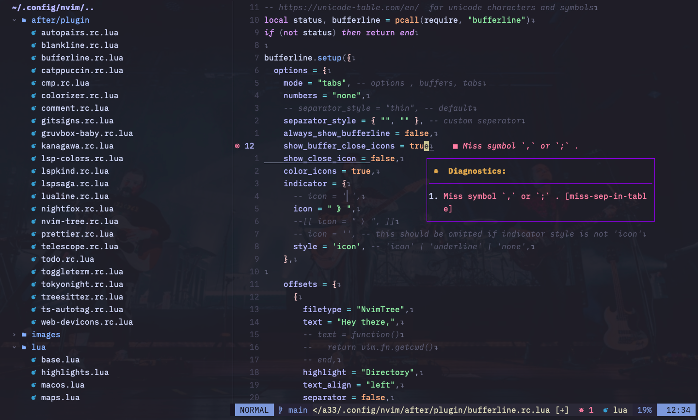

## Neovim config in lua

**Checkout** [Plugin](https://github.com/arvindchoudhary33/nvim-config-lua/blob/main/lua/plugins.lua) **for all the plugins used**

**Screenshots**

**What you see in screenshots ?.**

- Font ~ Hack Nerd Font Mono
- ColorScheme ~ Melange
- BG ~ Of Monsters and Men
- Plugins in use ~ NvimTree, Telescope, Bufferline, LSP Diagnostic ( Lspsaga ), NvimTransparent.

**Special Mention** [craftzdog](https://github.com/craftzdog) for step by step setup to neovim in lua

**Neovim setup in Lua by devaslife ( aka craftzdog ) [ Youtube Link ](https://www.youtube.com/watch?v=ajmK0ZNcM4Q)**
